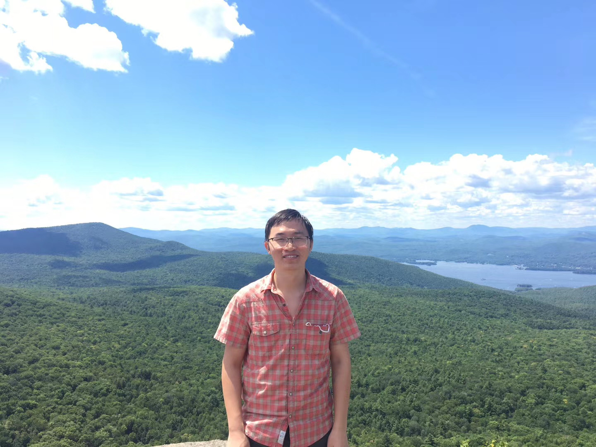

Feng-Lei FAN （FAN= Frontier of Artificial Networks ）
============

Bio
---------

I am a fourth-year BME PhD student in a small but lovely university ([Rensselaer Polytechnic Institute](https://www.rpi.edu/)) (RPI), US, where I feel blessed to be advised by [Dr. Ge Wang](https://biotech.rpi.edu/centers/bic/people/faculty/ge-wang) and have so many wonderful friends. Prior to RPI, I studied my undergraduate at [Harbin Institute of Tachnology](http://en.hit.edu.cn/), China. 

I am interested in deep learning, fuzzy logic, applied math, and medical imaging. Recently, my research focuses on developing advanced deep learning models and their interpretation. Besides my research, I am a big fan of math and physics. I am also operating a [blog](https://www.ershicimi.com/a/RjleG2QD) over WeChat together with my friends. If you are interested in my research, please feel free to reach me out (hitfanfenglei@gmail.com). 

[[Goodgle Scholar](https://scholar.google.com/citations?user=YPmyK2wAAAAJ&hl=en)][[Curriculum Vitae](https://github.com/FengleiFan/Feng-Lei.Fan.github.io/blob/gh-pages/MyResume.pdf)]
----------

News
----------
* **10/2020:** Our [blog](https://www.ershicimi.com/a/RjleG2QD) has attracted over **5,000** followers!

* **06/2020:** Our paper [**Soft Autoencoder and Its Wavelet Adaptation Interpretation**](https://ieeexplore.ieee.org/document/9162438) is accepted by **IEEE TCI**.

* **01/2020:** My internship at [**MIT-IBM Watson AI Lab**](https://mitibmwatsonailab.mit.edu/) starts! My mentor is [**Dimitry Krotov**](https://researcher.watson.ibm.com/researcher/view.php?person=ibm-krotov).

* **12/2019:** Our paper [**Quadratic Autoencoder (Q-AE) for Low-dose CT Denoising**](https://ieeexplore.ieee.org/abstract/document/8946589) is accepted by **IEEE TMI**.

* **09/2019:** Our paper [**Universal approximation with quadratic deep networks**](https://www.sciencedirect.com/science/article/pii/S0893608020300095) is accepted by **Neural Networks**.

* **07/2019:** Presentation at [**Fully3D2019**](https://www.med.upenn.edu/fully3d/).

* **06/2019:** My internship at [**Generic Electric, Global Research Center**](https://www.ge.com/research/) starts!

* **05/2019:** Our paper [**Fuzzy logic interpretation of quadratic networks**
](https://www.sciencedirect.com/science/article/pii/S0925231219312615) is accepted by **Neurocomputing**.

* **04/2019:** I am awarded as [**IBM-RPI AI Scholarship**](https://airc.rpi.edu/aihn-scholars). IBM will support my research by covering my tuition and living expenses until graduation.

* **04/2018:** Our paper [**Learning From Pseudo-Randomness With an Artificial Neural Network–Does God Play Pseudo-Dice?**](https://ieeexplore.ieee.org/abstract/document/8350369) is accepted by **IEEE Access**.

* **12/2017:** Our paper [**Generalized backpropagation algorithm for training second‐order neural networks**](https://onlinelibrary.wiley.com/doi/abs/10.1002/cnm.2956) is accepted by **International Journal for Numerical Methods in Biomedical Engineering**.

* **06/2017:** My undergraduate reserch work [**An Extending Result on Spectral Radius of Bipartite Graphs**](https://www.jstor.org/stable/90020207?seq=1) is accepted by **Taiwanese Journal of Mathematics**.

* **05/2017:** Our paper [**A new type of neurons for machine learning**](https://onlinelibrary.wiley.com/doi/abs/10.1002/cnm.2920) is accepted by **International Journal for Numerical Methods in Biomedical Engineering**.

* **06/2016:** My undergraduate reserch work [**A characterization of strongly regular graphs in terms of the largest signless Laplacian eigenvalues**](https://www.sciencedirect.com/science/article/pii/S0024379516301598) is accepted by **Linear Algebra and its Applications**.

